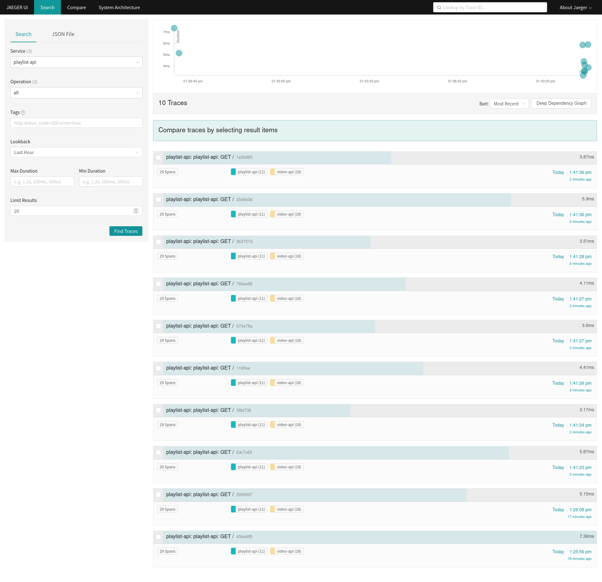
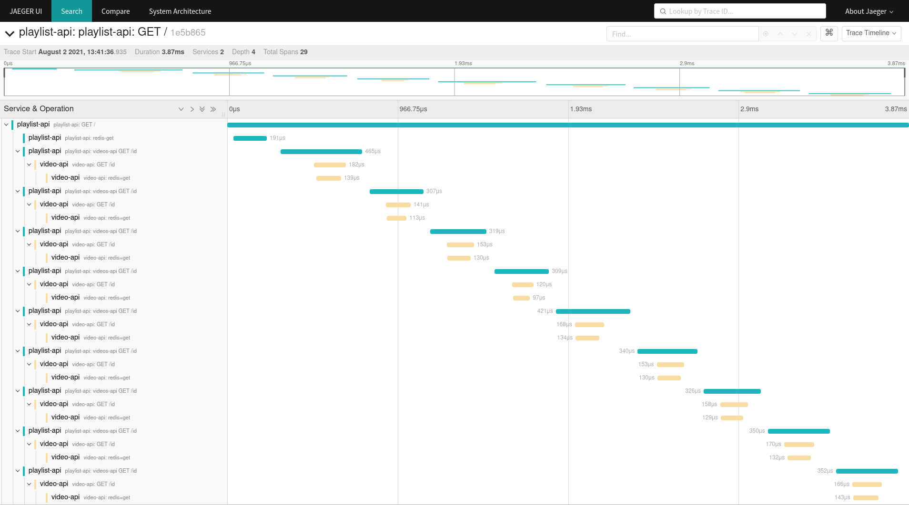

# Into to distributed tracing
Distributed tracing, also called distributed request tracing, is a method used to profile and monitor applications, especially those built using a microservices architecture. Distributed tracing helps pinpoint where failures occur and what causes poor performance. We use [opentelemetry standards](https://opentelemetry.io/) and [Jaeger UI](https://www.jaegertracing.io/) in this setup.

## Architecture

```
+------------+     +---------------+    +--------------+
| videos-web +---->+ playlists-api +--->+ playlists-db |
|            |     |               |    |    [redis]   |
+------------+     +-----+---------+    +--------------+
                         |
                         v
                   +-----+------+       +-----------+
                   | videos-api +------>+ videos-db |
                   |            |       |  [redis]  |
                   +------------+       +-----------+
```

## Run the app
There is a `docker-compose.yaml` in this directory.
Change your terminal to this folder and run:

```bash

docker-compose build

docker-compose up
```

You can access the app on [http://localhost](http://localhost). <br>You should now see the complete architecture in the browser

## Traces





## Credits

I had followed a tutorial by [marcel-dempers](github.com/marcel-dempers). Checkout his [YouTube channel](https://www.youtube.com/user/Kamakazihoer) for DevOps stuff. 